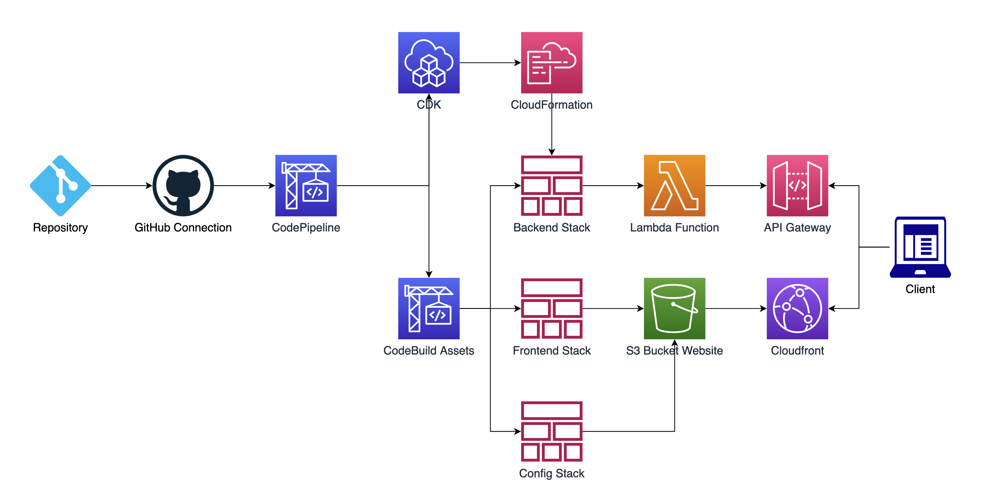

## Full Stack CDK Example

This example will build a CDK Pipeline that will build a backend and frontend and then pass API Gateway URL information from the backend to the frontend. This information can be used to make calls to the backend without having to manually pass the URL information. When connected to a Github repo, the CDK pipeline will automatically trigger and rebuild so changes to any portion of the app through GitHub.

**Please note: this deployment will create a file that will be accessible to the public so sensitive information should not be included. **



### CDK Pipeline

The pipeline created is a self-mutating pipeline associated with a GitHub repo using a CodeStar connection. This can be adjusted to other Pipeline [sources](https://docs.aws.amazon.com/cdk/api/v2/docs/aws-cdk-lib.pipelines-readme.html#synth-and-sources).

This pipeline contains a single Stage with three Stacks.

```typescript
    const pipeline = new pipelines.CodePipeline(this, 'Pipeline', {
      ...
    });

    const stages = new Stages(this, 'Stages', {});
    pipeline.addStage(stages);
```

### Backend Stack

```typescript
export class Backend extends Stack {
  public readonly config: Object;

  constructor(scope: Construct, id: string, props?: StackProps) {
    super(scope, id, props);
    ...
    this.config = {
      API_URL: api.url,
    };
  }
}
```

The Backend stack creates a sample Lambda function and associates it with an API Gateway. The URL from this API Gateway is used as the output in a JSON Object that will be used in the Config Stack.

### Frontend Stack

The Frontend Stack is a simple S3 + Cloudfront Distribution that will be used to host a React SPA. Before uploading to the S3 bucket with `s3deploy.BucketDeployment` it must be bundled. The output of this `yarn build` will be copied to the outputDir and deployed to the S3 bucket.

```typescript
const bundle = s3deploy.Source.asset('./site', {
  bundling: {
    command: [
      'sh',
      '-c',
      'echo "Docker build not supported. Please install esbuild."',
    ],
    image: DockerImage.fromRegistry('alpine'),
    local: {
      tryBundle(outputDir: string) {
        try {
          execSync('esbuild --version', execOptions);
        } catch {
          /* istanbul ignore next */
          return false;
        }
        execSync(
          'cd site && yarn install --frozen-lockfile && yarn build',
          execOptions,
        );
        copySync('./site/build', outputDir, {
          ...execOptions,
          recursive: true,
        });
        return true;
      },
    },
  },
});
```

### Config Stack

The Config stack creates a `config.json` file in the S3 bucket that was created in the Frontend Stack with the API URL information from the Backend Stack using a CustomResource.

````typescript
new customresource.AwsCustomResource(this, 'ConfigFrontEnd', {
      onUpdate: {
        service: 'S3',
        action: 'putObject',
        parameters: {
          Body: JSON.stringify(props.config),
          Bucket: props.siteBucket.bucketName,
          Key: 'config.json',
        },
        physicalResourceId: customresource.PhysicalResourceId.of(
          Date.now().toString(),
        ),
      },
      policy: customresource.AwsCustomResourcePolicy.fromSdkCalls({
        resources: customresource.AwsCustomResourcePolicy.ANY_RESOURCE,
      }),
    });
    ```
````

### React App

With the Backend and Frontend created, the React App deployed to the S3 bucket must read the `config.json` file that was created in the Config Stack. It is very important to note that this file is publically visible so you should not put any sensitive information in it. Another [method](https://docs.aws.amazon.com/apigateway/latest/developerguide/apigateway-control-access-to-api.html) should be used to secure your API Gateway.

```javascript
export async function config() {
  const data = await fetch('./config.json').then((response) => response.json());

  const AmplifyConfig = {
    API: {
      endpoints: [
        {
          name: 'demoApi',
          endpoint: data.API_URL,
        },
      ],
    },
  };

  return AmplifyConfig;
```

The [Config.js](site/src/Config.js) file is used to fetch the information in the `config.json` file that was written to the S3 bucket by the Config Stack. To use this locally, this file must be copied to the `src/site/public` directory.

```javascript
const apiConfig = await config();
API.configure(apiConfig);
const randomNumberResult = await API.post('demoApi', 'demo', {
  body: {},
});
setRandomNumber(randomNumberResult);
```

The React App uses Amplify to make API calls using the API information from the `Config.js` file. This could be enhanced with Cognito to provide API Gateway security.
